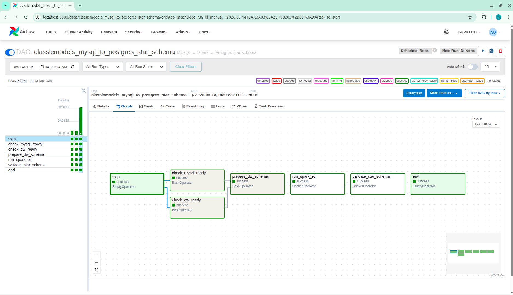
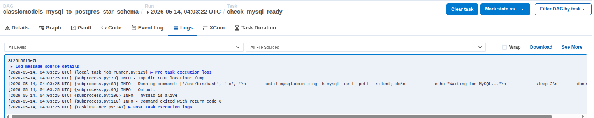

# Classicmodels MySQL to PostgreSQL Star Schema Pipeline


```text
MySQL classicmodels
  -> Spark ETL định kỳ
  -> PostgreSQL star_schema_dw (Data Warehouse)
      -> Schema: star_schema (Dimensions & Facts)
```

Stack:

- `mysql`: source RDBMS, seed database `classicmodels`.
-  `postgresql`: data warehouse for star schema
- `etl`
- `query`: chạy vài câu query kiểm tra star schema.
- `airflow`: monitor, orchestrate pipeline

## Chạy 

```bash
docker compose --profile airflow up
```
Truy cập Airflow UI tại: http://localhost:8080 (User/Pass: admin/admin).
Query kết quả:

```bash
docker compose run --rm query
```

## DAG
```text
classicmodels_mysql_to_postgres_star_schema```

Workflow trong DAG:

```text
start
  -> check_mysql_ready
  -> check_dw_ready
  -> prepare_dw_schema
  -> run_spark_etl
  -> validate_star_schema
  -> end
```


Scheduling:

- DAG duoc lap lich moi 1 phut bang `schedule=timedelta(minutes=1)`.
- `max_active_runs=1` de tranh nhieu lan ETL chay chong len nhau.

Orchestration:

- Airflow quan ly thu tu task.
- Neu check MySQL/PostgreSQL fail thi ETL khong chay.
- Neu ETL fail thi validation query khong chay.

Monitoring:

- Airflow UI hien thi Graph, Grid, lich su lan chay, trang thai tung task va logs.
- Nen screenshot Graph view, Grid view, task logs cua `run_spark_etl`, va task logs cua `validate_star_schema`.


